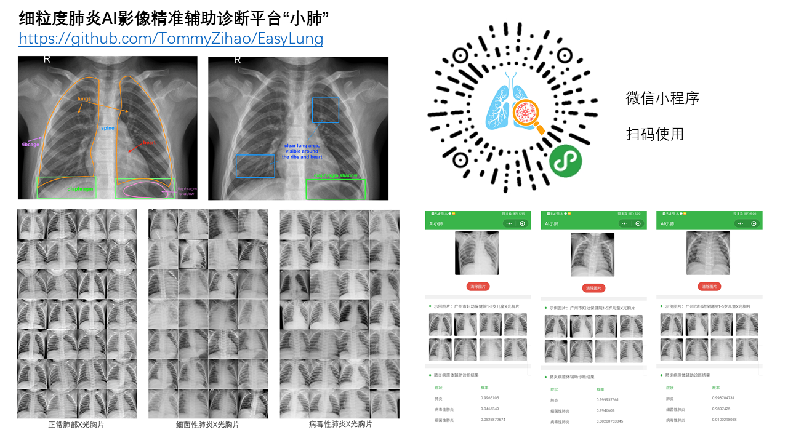
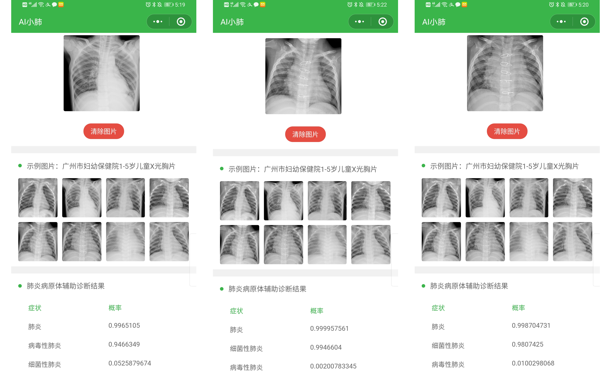
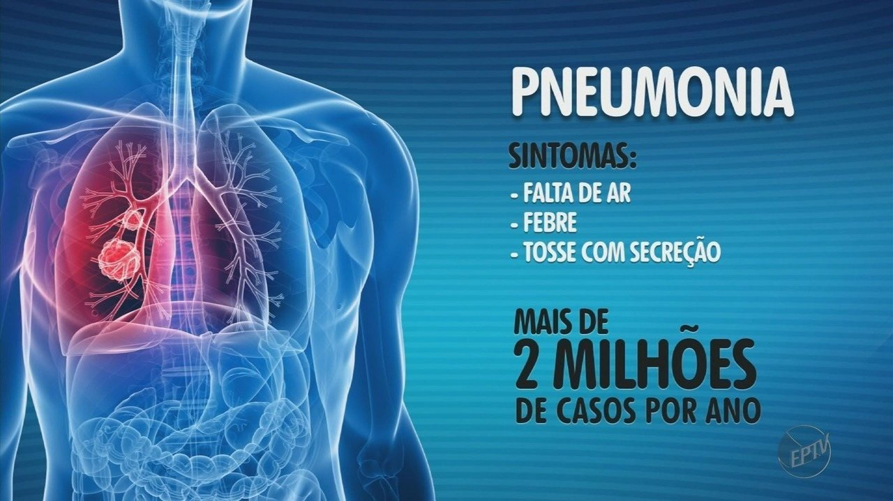
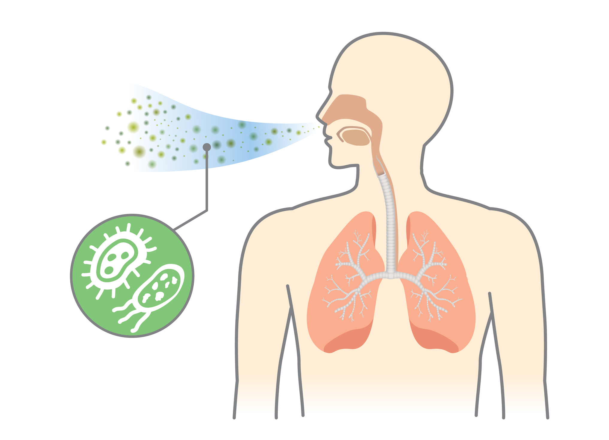
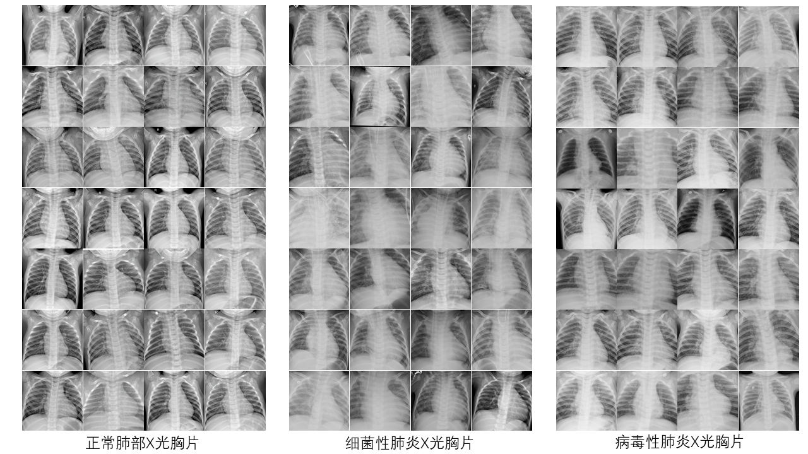
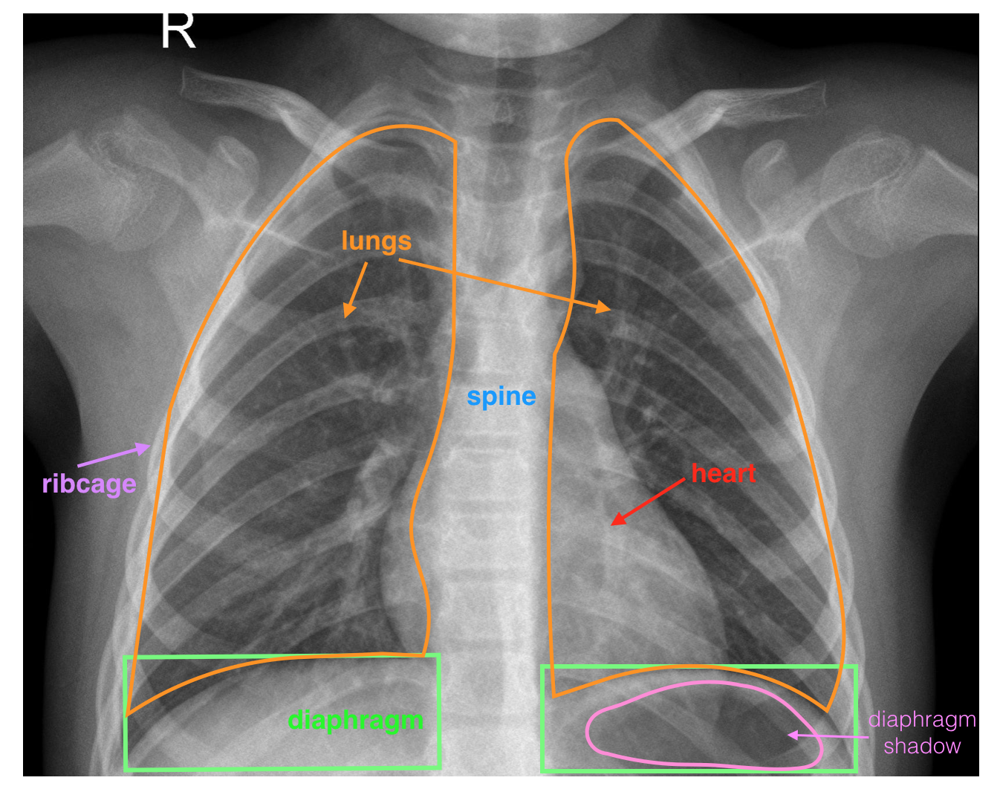
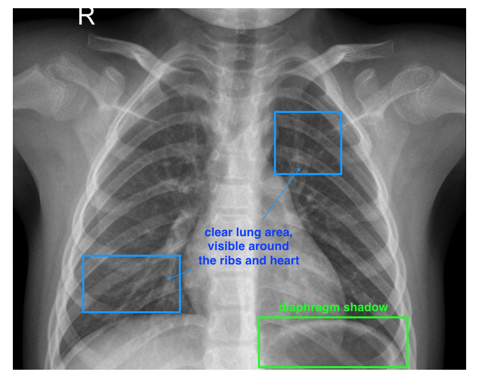
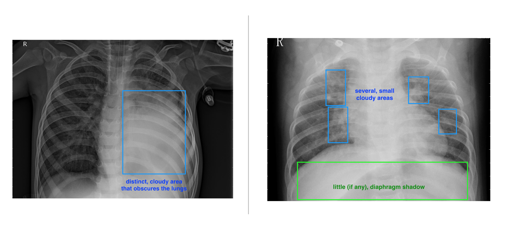

# 智辨病菌，洞见肺腑——细粒度肺炎AI影像精准辅助诊断平台“小肺”

[TOC]

# 一句话介绍小肺

从X光胸片医疗影像中AI智能识别肺炎及病原体种类的辅助诊断平台，包含网页、微信小程序、APP。

将论文写在祖国大地上，写入肺腑肝胆中，AI医疗中的同济智慧。

# 如何使用小肺

进入微信小程序或在PC端输入网址，上传本地X光胸片图像，或点击测试图片，即可进行AI智能肺炎识别。

## 微信小程序

## 网页

https://aixf.coderai.cn/

# 关于小肺

## 肺炎——发展中国家儿童夭折首要原因

世界卫生组织的报告显示，全球每年因肺炎致死的儿童多达200万，超过HIV/AIDS、疟疾和麻疹致死人数的总和，成为儿童夭折的首要原因。95%的新发儿童临床性肺炎病例发生在发展中国家，包括东南亚、非洲、拉丁美洲地区。

细菌和病毒是造成肺炎的两大主因。早期肺炎类型诊断十分关键。

细菌性肺炎需要立即进行抗生素治疗，防止支气管肺炎链球菌、葡萄球菌扩散。

病毒性肺炎需要立即隔离患者，防止飞沫传染，2002年“非典”疫情成为中国人的共同记忆。

肺炎会造成呼吸困难、高烧、持续咳嗽、神经系统紊乱、胃肠道功能紊乱。肺炎的严重程度通常可通过CURB-65指标衡量。

根据X射线胸片影像及病理状态，肺炎分为大叶性肺炎、支气管肺炎（小叶性肺炎）和间质性肺炎。

目前肺炎的诊断主要依赖血检、胸片、痰菌培养 ，血检需要穿刺抽血，胸片分析则需有经验的医生，菌痰培养需要较长时间。落后地区医疗资源紧缺，过度依赖人工判断，不仅使医生筋疲力尽，也会带来漏检。患者排队三小时，看病五分钟，专家号千金难求，精准医疗却遥不可及。

## 小肺的愿景——智慧医疗诊断，助力精准扶贫

党的十九大报告指出，  预防控制重大疾病，实施健康中国战略。推动互联网、大数据、人工智能和实体经济深度融合。 

我们希望借助前沿的人工智能图像识别算法，从肺炎医疗大数据影像中进行细粒度数据挖掘，并搭建网页和微信小程序页面，为医生减负，为患者提供精准诊断，帮助贫困地区打赢脱贫攻坚战。

## 小肺的黑科技——卷积神经网络与迁移学习

以卷积神经网络CNN为代表的图像分类算法近年来迅速发展，并超过人类水平，小肺基于深度残差网络ResNet、Xception、MobileNet、微软自动机器学习工具进行迁移学习，采用了Fine-tuning微调技巧进行类别不平衡细粒度模型训练，采用多分类混淆矩阵进行算法性能评估。

将神经网络推断接口封装为Restful-API，实现前后端分离。

基于国人自主研发的开源前端框架Vue.js搭建网站，将网页和后端API部署在华为云、微软Azure和阿里云轻量应用服务器，实现负载均衡和自动化测试运维。

搭建微信小程序，基于腾讯云实现云开发。

.jpg)

## 参考文献与数据集

 Kermany, Daniel S., et al. "Identifying medical diagnoses and treatable diseases by image-based deep learning." *Cell* 172.5 (2018): 1122-1131. 

广州市妇幼保健院1-5岁儿童X光胸片图像 、Kaggle数据科学竞赛

https://data.mendeley.com/datasets/rscbjbr9sj/2 

 https://www.kaggle.com/paultimothymooney/chest-xray-pneumonia 

数据集说明： https://www.bilibili.com/video/av75493153 

训练数据包含：

正常肺部X光影像1579张

细菌性肺炎X光影像2760张

病毒性肺炎X光影像1485张

## 小肺开发团队

产品经理、数据处理、API搭建、文档：子豪兄

用户交互设计、文档：吴姗姗

Bilibili视频专栏：同济子豪兄

前端开发、服务器运维：Maxoyed

技术加持：微软Azure、Kaggle、阿里云、华为云、腾讯云、AWS、开课吧、Udacity

鸣谢：

同济大学微软学生俱乐部、开源软件协会

清华大学开源软件镜像站

重庆大学微软学生俱乐部、人工智能协会、网络信息协会

西南人工智能爱好者联盟

微软2018教育部产学合作协同育人 创新创业联合基金项目

微软创新实践工作站项目

特别说明：本产品可能存在偏差，仅作辅助诊断使用，如有不适请及时就医。

# X光胸片医疗影像解读

图片来源：Udacity

# 正常肺部

# 病毒性肺炎

X光胸片影像特征：肺部炎症呈斑点状、片状或均匀的阴影。 

病毒性肺炎发生于冬春季节， 可通过空气飞沫传播， 小儿发病率高于成人。 

临床表现：发热、头痛、全身酸痛、干咳、肺浸润。

引起肺炎的病毒不多见，其中以流行性感冒病毒为常见，其他为副流感病毒、巨细胞病毒、腺病毒、鼻病毒、冠状病毒和某些肠道病毒，如柯萨奇、埃可病毒等，以及单纯疱疹、水痘-带状疱疹、风疹、麻疹等病毒。婴幼儿还常由呼吸道合胞病毒感染产生肺炎。 

# 细菌性肺炎

X光胸片影像特征： 细菌性肺炎早期阅片时仅看到肺纹理的增粗，或有病变的肺叶或肺段出现有斑片样的表现。肺炎后期可能出现肺部影像大片发白，主要表现为肺的实变影，且在实变影当中可看到充气征，即在实变的影子白色的里面，可看到支气管的走形，甚至部分患者从胸片中可看到出现少量的胸腔积液，即肺积水。 

临床表现： 咳嗽、咳痰、乏力、胸痛、 头痛、肌肉酸痛 、恶心、呕吐、腹胀、腹泻 

血检指标：白细胞计数及中性粒细胞一般均增高 

致病菌包括肺炎链球菌、金黄色葡萄球菌、肺炎克雷伯杆菌、流感嗜血杆菌、铜绿假单胞菌等。

